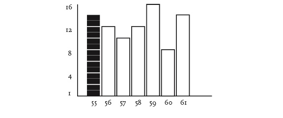
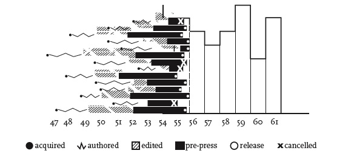
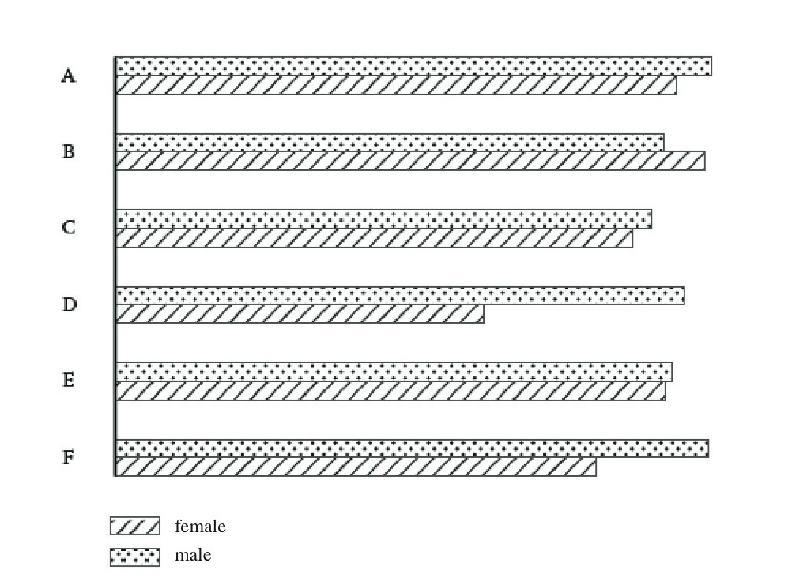

## Representing Data in the Humanities: Untapped potential

Non-textual representations of information can and should be used to represent cultural phenomena. Moving between written and visual mediums offers new paradigms for digital humanities where readers can think critically for both textual and graphical modes. 

As such, all forms of humanities could benefit from students and graduates having access to more multimodal artifacts. A generation of scholars exposed to more of these multidimensional graphics and educational texts will increase the overall level of critical literacy with which digital humanities workers can use to solve unique problems. 

However, I believe that making use of tools which simply analyze text and represent trends and topics graphically is a substandard use of critical analysis and data representation. Observing the way which Moretti and Drucker use graphics, charts and maps to *humanize* data can prove to be an exemplary starting point for those who are studying the digital humanities or seeking to create superior information graphics. 

Moving forward, I will summarize why Drucker and Moretti have such potential to shift the Humanities by examining Drucker’s “Humanities Approaches to Graphical Display” and Moretti’s “Graphs, Maps, Trees.” Subsequently, I will follow up on certain examples used in their work by reinterpreting the data they have given to create new graphical representations which provide additional depth to their analyses. 
 

## Moretti: Contextualizing Quantitative data
 
Intro to Moretti points
 
 
### Figure 1 of Moretti
 

 
Content
 
### Figure 5 of Moretti
  

 
Content
 
 

## Drucker: Humanizing data
 
Intro to Drucker points
 
 

 
Figure 1. A basic bar chart compares the number of men (top bar) and the number of women (bottom bar) in seven different nations, A through F, at the present time (2010). The assumptions are that quantities (number), entities (nations), identities (gender) and temporality (now) are all self-evident. Graphic credit Xárene Eskandar.
 
 

 
Figure 2. In this chart gendered identity is modified. In nation A, the top bar contains a changing gradient, indicating that “man” is a continuum from male enfant to adult, or in countries E and D, that gender ambiguity is a factor of genetic mutation or adaptation, thus showing that basis on which gendered individuals are identified and counted is complicated by many factors. In country F women only register as individuals after coming of reproductive age, thus showing that quantity is a effect of cultural conditions, not a self-evident fact. The movement of men back and forth across the border of nations B and C makes the “nations” unstable entities. Graphic credit Xárene Eskandar.
 
 

 
Figure 3. A chart shows the number of new novels put into print by a single publisher in the years 1855-1862.
 
 

 
Figure 4. The “appearance” in 1855 of fourteen novels is shown in relation to the time of writing, acquisition, editing, pre-press work, and release thus showing publication date as a factor of many other processes whose temporal range is very varied. The date of a work, in terms of its cultural identity and relevance, can be considered in relation to any number of variables, not just the moment of its publication. Graphic credit Xárene Eskandar.
 
 

<iframe style='width: 509px; height: 330px;' src='https://voyant-tools.org/tool/Cirrus/?visible=25&corpus=cc745d48267e0d33902df78b7d9f644f'></iframe> 

<iframe style='width: 508px; height: 330px;' src='https://voyant-tools.org/tool/Topics/?numTopics=10&limit=6&corpus=cc745d48267e0d33902df78b7d9f644f'></iframe>
 

