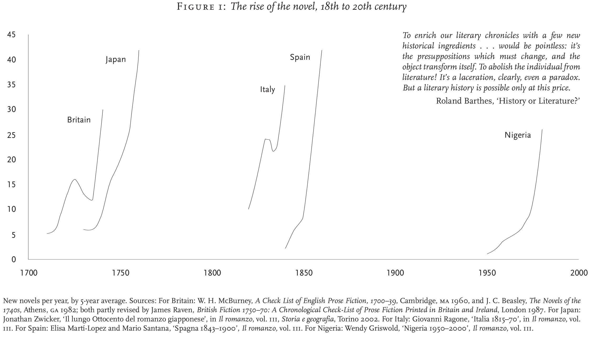
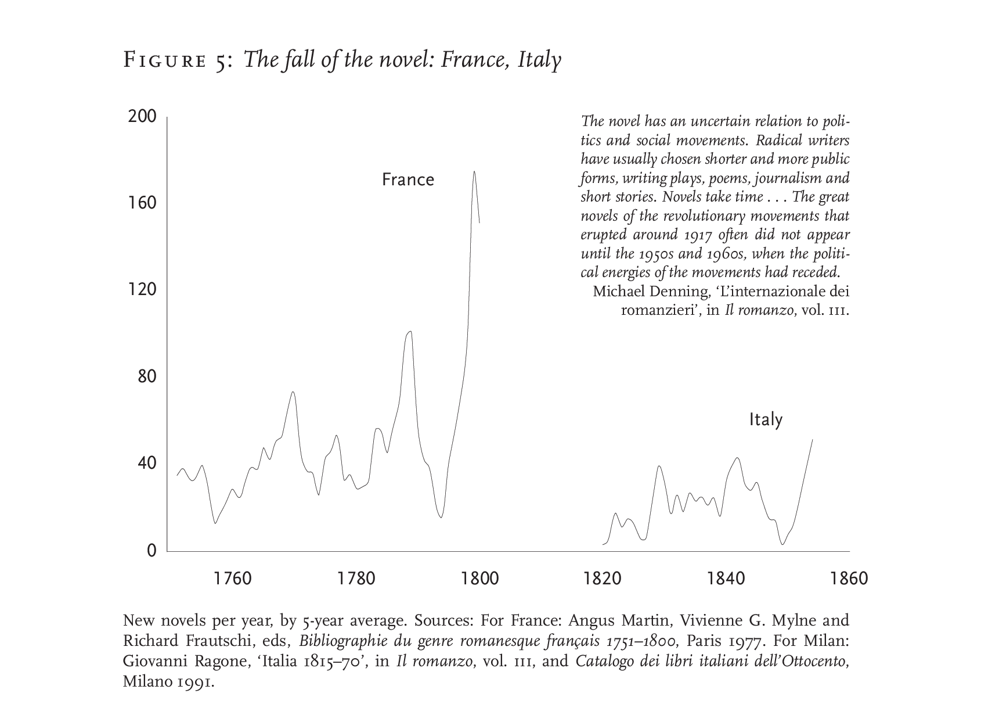

## Representing Data in the Humanities: Untapped potential

Non-textual representations of information can and should be used to represent cultural phenomena. Moving between written and visual mediums offers new paradigms for digital humanities where readers can think critically for both textual and graphical modes. 

As such, all forms of humanities could benefit from students and graduates having access to more multimodal artifacts. A generation of scholars exposed to more of these multidimensional graphics and educational texts will increase the overall level of critical literacy with which digital humanities workers can use to solve unique problems. 

However, I believe that making use of tools which simply analyze text and represent trends and topics graphically is a substandard use of critical analysis and data representation. Observing the way which Moretti and Drucker use graphics, charts and maps to *humanize* data can prove to be an exemplary starting point for those who are studying the digital humanities or seeking to create superior information graphics. 

Moving forward, I will summarize why Drucker and Moretti have such potential to shift the Humanities by examining Drucker’s “Humanities Approaches to Graphical Display” and Moretti’s “Graphs, Maps, Trees.” Subsequently, I will follow up on certain examples used in their work by reinterpreting the data they have given to create new graphical representations which provide additional depth to their analyses. 
 

## Moretti: Contextualizing Quantitative data
  It’s no coincidence that media often depicts boring jobs with meetings where businesspersons present bar charts and broken line graphs to their equally uninterested colleagues. It’s because summarizing quantitative data is stuck in a very cookie-cutter like mentality. This does not mean that quantitative data, such as sales and quarterly revenues, are inefficiently summarized. **It simply means that bar charts and line graphs are what we’ve come to expect when we’re asked to interpret or represent data.** There are two major issues with this: The first is that when interpreting data, expecting something can lead to bias or omitting trends and irregularities with the data. The second major issue with expecting typical information graphics is the multi-faceted issue of assuming there is no context to the data. 

Franco Moretti’s “Graphs, Maps and Trees: *Abstract Models for Literary History*” addresses these problems adequately throughout his text. His article examines primarily quantitative data about literary genres in Britain and various other countries throughout the 18th, 19th and 20th Centuries. However, the analysis intends to look at the social aspects and implementations that stem from the quantitative data which was collected. Moretti makes this clear through the types of graphics he uses, the way he titles and sorts the information on the graphics and by adding contextual knowledge outside of the graphics. 
 

  The first thing to note about Moretti’s graphics are that they are mostly line charts and bar charts. However, there are distinctions about them which are very important to understand when considering how Moretti is choosing to represent his data. The line charts, for instance, are not broken-line charts. The lines are curved rather than straight because the historical data is not perfect; there are inaccuracies and potentially over- or underestimated data adding straight lines would dismiss this by depicting clearly designated paths. Moretti is looking at larger trends in Figure 1, depicted above, and comparing individual points of data is not the goal of the graph, or the article for that matter. Moretti therefore he stays away from any specific points of data.  
 
### Figure 1 of Moretti
 

(Moretti)
 
 
Moretti also uses individual graphics to make individual arguments, as opposed to putting too much data into one representation and picking at it with many blocks of text. Figure 1 seeks to compare the rise of the novel in various countries. It puts in evidence the shape of the curves, and the approximate time of the up rise by only showing the sections of the graph when the novel gets popularized. The time is scaled in half-centuries, because the emphasis is on approximately how long it took for certain countries to adopt the new form of literature; not how long it took for them to publish a certain number per year. The curves are spaced out enough that various colours are not needed to differentiate the countries. Thus, there is no need for a legend that one might have to constantly refer to.
 
### Figure 5 of Moretti
  

(Moretti)
 
 
Subsequently, Moretti looks at the fall of the novel in various countries. However, as the trends tend to vary in terms of shape between the countries, the fall of the novel is examined with a graphic for each country but France and Italy, which share a chart. This affords readers two potential luxuries without reading any of the accompanying text: The reader will likely realize that there are remarkable similarities between the novel’s rises and fallings in France and Italy despite them occurring about 60 years apart. Second, if the reader is knowledgeable in history, they may realize that the largest fall and rise of the novel in France occurred amid the French revolution; and quick research could tell the reader that the biggest fall and rise for the novel in Italy was also in a time of instability. Note that Moretti doesn’t expect the reader to know these details or interpret the data themselves; he is trying to make arguments after all, and thus mentions the facts above in a further detailed paragraph. The reason the graphic here is so important to reshaping the way we represent information, is that a reader could understand these patterns and interpretations without the provided explanations.**The ideal graph speaks for itself and allows the reader to make the conclusions themselves.** Moretti achieves this with most of his information graphics, but he could certainly learn from Drucker when it comes to “humanizing” data.
 
 

## Drucker: Humanizing data
Drucker’s article “Humanities approaches to Graphical Display” is aptly named: Drucker explores informational graphics by Xarène Eskandar, all of which are of various data types and functions. Drucker attempts to show a variety of ways to represent data with minor changes to traditional information graphics with the aim of contextualizing the data. This supports the importance he gives to recognizing data as capta, and that data is impacted by humans whether it is quantitative or qualitative. Unfortunately, many of the graphics lack immediate clarity, but are very creative in terms of expressing non-quantifiable data, such as stress, temporality and anxiety (see Figures 7, 8, 10 and 11 of Drucker, 2011). His most notable approaches to graphical display, however, encourage the inclusion “nuanced data.” These approaches allow for expansive contextual information to be included with quantitative data, effectively turning it into “humanistic” qualitative capta; a useful tool for humanists. 
 
### Figure 1 of Drucker
 

 
"Figure 1. A basic bar chart compares the number of men (top bar) and the number of women (bottom bar) in seven different nations, A through F, at the present time (2010). The assumptions are that quantities (number), entities (nations), identities (gender) and temporality (now) are all self-evident. Graphic credit Xárene Eskandar." (Drucker)
 
 
### Figure 2 of Drucker
 

 
"Figure 2. In this chart gendered identity is modified. In nation A, the top bar contains a changing gradient, indicating that “man” is a continuum from male enfant to adult, or in countries E and D, that gender ambiguity is a factor of genetic mutation or adaptation, thus showing that basis on which gendered individuals are identified and counted is complicated by many factors. In country F women only register as individuals after coming of reproductive age, thus showing that quantity is a effect of cultural conditions, not a self-evident fact. The movement of men back and forth across the border of nations B and C makes the “nations” unstable entities. Graphic credit Xárene Eskandar." (Drucker)
 
 
Figure 1 is an example of a bar chart showing the male and female populations in various nations. Next to it, Figure 2 shows different ways the chart could be altered to acknowledge that population counts are made of people. This is an answer to the trope that people end up being statistics. Drucker is suggesting that we can humanize this bar chart. Where males move across the borders of C and B frequently, the charts blend with one another. Age is added as a factor in Country A, where the approximate number of children which are male blend into the number of adult males on one bar. Other ways to give depth to the data include acknowledging cultural practice as well as self-identified genders, however I believe that the key to this lies in accurate labelling of data: Sex and gender are very distinct concepts, and being careless while representing both can lead to skewed and misinterpreted capta. 
 
### Figure 3 of Drucker
 

 
"Figure 3. A chart shows the number of new novels put into print by a single publisher in the years 1855-1862." (Drucker)
 
 
### Figure 4 of Drucker
 

 
"Figure 4. The “appearance” in 1855 of fourteen novels is shown in relation to the time of writing, acquisition, editing, pre-press work, and release thus showing publication date as a factor of many other processes whose temporal range is very varied. The date of a work, in terms of its cultural identity and relevance, can be considered in relation to any number of variables, not just the moment of its publication. Graphic credit Xárene Eskandar."(Drucker)
 
 
The second set of graphics Drucker uses compliments Moretti’s work on novels, and addresses Moretti’s desire for more context with his data. Simply put, Drucker takes a simple bar chart and looks at each unit, which is in this case each published book in a year and gives them a history. Books do not simply get written and published in a year. They typically take much more time than that, and Drucker suggests that this is important humanists to recognize. He proves it is possible with Eskandar’s graphic example which shows, as the legend explains, when the books were acquired, authored, edited, etc. Until the moment they are published in the same year. At a glance, this may seem inefficient, as a reader can only see the history of one year’s published books at a time, but using technology, charts can expand and retract, highlight trends and generate projections and models. This is simply the beginning for representing information graphically, if only more humanists considered Drucker and Moretti’s work as building blocks. 
 
 

<iframe style='width: 509px; height: 330px;' src='https://voyant-tools.org/tool/Cirrus/?visible=25&corpus=cc745d48267e0d33902df78b7d9f644f'></iframe> 

<iframe style='width: 508px; height: 330px;' src='https://voyant-tools.org/tool/Topics/?numTopics=10&limit=6&corpus=cc745d48267e0d33902df78b7d9f644f'></iframe>
 

